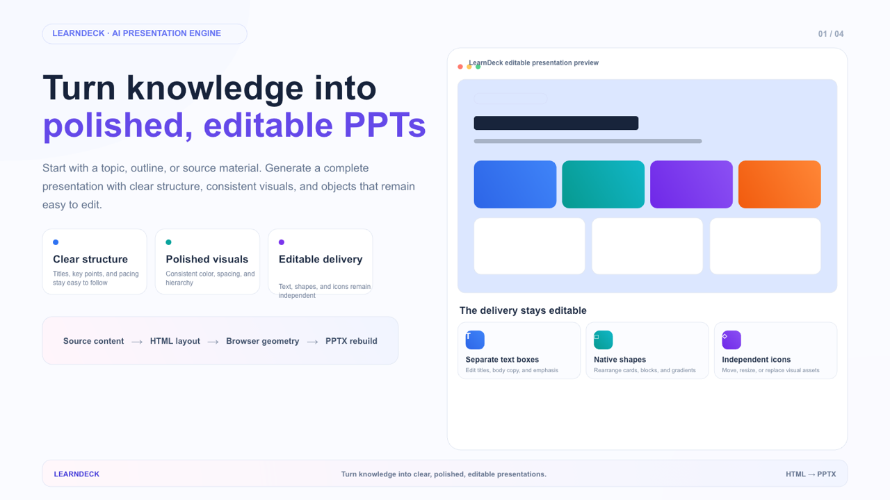
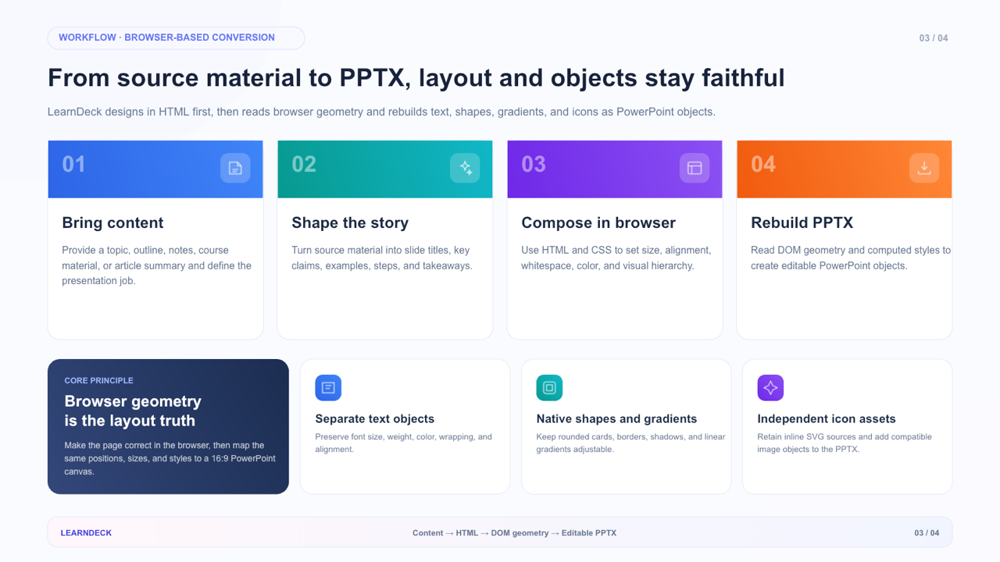

# LearnDeck

<p align="center">
  <a href="README.zh-CN.md">简体中文</a> · English
</p>

<p align="center">
  
</p>

<p align="center">
  <strong>Let AI create PPTs in one click.</strong><br>
  Turn knowledge into clear, polished, editable presentation decks.
</p>

---

## What Is LearnDeck?

LearnDeck is an AI presentation companion for learning content.

It helps you turn a topic, outline, notes, course material, article summary, or rough idea into a clear, beautiful, editable PPT. Instead of starting from a blank deck, you start with knowledge. LearnDeck helps shape that knowledge into a presentation people can follow.

The idea is simple: let AI create the first high-quality PPT for you, then keep the result easy to revise, personalize, and reuse.

## Why It Exists

Learning content often has enough substance, but turning it into a deck takes time:

- You need a clear order for the ideas
- You need pages that are easy to scan
- You need a polished look that feels presentation-ready
- You need the result to stay editable after generation
- You need something that works for teaching, training, reporting, or sharing

LearnDeck is designed for that moment when you already have knowledge, but need a deck that makes it easier to teach and easier to understand.

## Who It Is For

- Teachers, instructors, and workshop hosts
- Course creators and knowledge creators
- Teams preparing internal training or onboarding material
- Learners and researchers turning notes into reports
- Anyone who wants AI to turn scattered knowledge into a presentable PPT

## What You Get

- **One-click PPT generation** from a topic, outline, notes, or learning material
- **Clearer structure** with sections, key points, examples, and takeaways
- **Polished pages** that feel ready for lessons, workshops, reports, and sharing
- **Editable delivery** so you can keep refining the wording, flow, and style
- **Multiple visual styles** such as clean, academic, warm, bold, or dark
- **Reusable knowledge assets** that can grow into courses, training decks, or study reviews

## Install

Run:

```bash
npx --yes github:LearnAIHubC/LearnDeck
```

Then restart Codex and use `$learn-deck`.

To update an existing installation:

```bash
npx --yes github:LearnAIHubC/LearnDeck --force
```

## Showcase Templates

- [Download the English editable PPTX template](templates/learn-deck-showcase-en.pptx)
- [Download the Chinese editable PPTX template](templates/learn-deck-showcase-zh.pptx)

The cover and workflow images in this README are rendered from these actual editable decks.

## What Can You Create?

LearnDeck is especially useful for:

- Course introductions and lesson outlines
- Classroom slides and learning cards
- Internal training decks
- Learning progress reports
- Study group and book club presentations
- Methodology explainers
- Product or business knowledge training
- Research summaries and knowledge reviews

If your goal is to help people understand something more clearly, LearnDeck gives you a strong first deck.

## The Experience

1. **Bring content**: start with a topic, outline, notes, article summary, or course material
2. **Let AI shape it**: organize the message into titles, key points, examples, and takeaways
3. **Create PPT**: get a coherent deck with a clean visual style and a clear learning rhythm
4. **Edit freely**: adjust wording, tone, brand, sequence, and classroom style

<p align="center">
  
</p>

## Why The Name LearnDeck?

“Learn” stands for learning content, knowledge sharing, and teaching moments.

“Deck” stands for a complete presentation that can be taught, shared, edited, and reused.

LearnDeck is not just a slide maker. It is a learning-deck partner that helps knowledge become a complete presentation with flow, clarity, and visual polish.

## Vision

LearnDeck aims to make high-quality learning decks easier to create.

It is for people who have ideas, notes, expertise, or teaching material, but do not want to spend most of their time shaping structure and polishing pages. A good PPT should help the presenter speak clearly and help the audience understand easily.

LearnDeck exists to make that bridge lighter, faster, and more beautiful.

## 友情链接

- [LINUX DO](https://linux.do/) —— 新的理想型社区，技术爱好者的聚集地。
