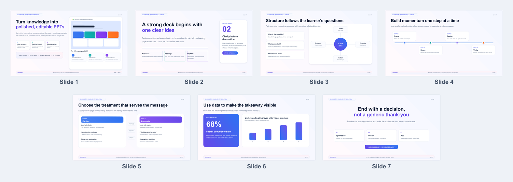

<div align="center">

<h1>LearnDeck</h1>

<h3>Model-designed HTML → polished, editable PowerPoint</h3>

<p>
  Turn a topic, outline, notes, or source material into a coherent presentation.<br>
  The model designs each slide in HTML/CSS, then LearnDeck rebuilds it as editable PPTX objects.
</p>

<p>
  <a href="README.zh-CN.md">简体中文</a>
  ·
  <a href="templates/learn-deck-polished-style.html">HTML style library</a>
  ·
  <a href="templates/learn-deck-polished-style.pptx">Editable PPTX</a>
</p>

<p>
  
  
  
  
</p>


</div>

## Why LearnDeck

Most presentation generators make you choose between a rigid schema and a flattened screenshot. LearnDeck takes a different route:

| Design follows the message | The result stays editable | Quality is visually verified |
| --- | --- | --- |
| The model authors the final HTML/CSS directly. No fixed layout enum is required. | Text, cards, shapes, gradients, and icons are rebuilt as separate PowerPoint objects. | Chromium audits the DOM before conversion; the final PPTX is rendered once for delivery QA. |

The default creative pipeline does **not** require an intermediate JSON slide plan:

```text
content + visual direction
        ↓
model-designed HTML/CSS
        ↓
browser DOM audit
        ↓
browser-measured geometry
        ↓
editable PowerPoint objects
        ↓
contact-sheet + full-size visual QA
```

## Latest seven-slide style system

<p align="center">
  
</p>

This showcase includes a cover, statement page, relationship map, timeline, comparison, data story, and action close. It is a **composition library, not a mandatory sequence or fixed content template**. The user's content still determines the slide count, structure, visual emphasis, and layout of every page.

## Quick start

### 1. Install the Skill

```bash
npx --yes github:LearnAIHubC/LearnDeck
```

Restart Codex, then invoke `$learn-deck`. To refresh an existing installation:

```bash
npx --yes github:LearnAIHubC/LearnDeck --force
```

### 2. Describe the presentation you want

```text
Use $learn-deck to turn my onboarding notes into a concise 10-slide deck.
Use a calm editorial style with generous whitespace and a clear data story.
Keep every text box, shape, gradient, and icon editable in PowerPoint.
```

You can provide a topic, outline, document, course material, study notes, brand direction, or reference image. LearnDeck derives the visual language from the request instead of forcing the content into a preset card count.

### 3. Audit the DOM before conversion

```bash
node scripts/html_to_ppt.js \
  --input path/to/deck.html \
  --dom-audit-only
```

This Chromium preflight checks slide and text overflow, declared overlap/containment rules, unexpected single-line wrapping, centered text, centered SVG icons, chart labels, and text safety inside circles and compact cards. It produces structured errors without generating screenshots.

### 4. Keep revising the same HTML

The generated HTML remains the source of truth. When the content or style changes, LearnDeck edits that HTML, reconverts the PPTX, rerenders the previews, and checks the result again.

## What stays editable

| HTML/CSS source | PowerPoint output |
| --- | --- |
| Headings, paragraphs, labels, and bullets | Separate editable text boxes |
| Cards, panels, pills, borders, and circles | Native PowerPoint shapes |
| Linear gradients and quiet decorative accents | Editable gradient and shape objects |
| Inline SVG icons | Separate icon objects, with SVG sources preserved |
| Browser positions and dimensions | Rebuilt on a 16:9 PowerPoint canvas |

The converter favors **editable, separated elements** over a single full-slide screenshot.

## DOM first, final render once

LearnDeck separates fast structural validation from final presentation validation:

1. **Browser DOM preflight, no screenshots** — catches overflow, overlap, wrapping, centering, icon, chart-label, circle, pill, and card failures before a PPTX is written.
2. **Final contact-sheet review** — checks narrative flow, composition variety, density, whitespace, hierarchy, color, and page-to-page consistency.
3. **Final full-size slide review** — checks PowerPoint-specific clipping, wrapping, reconstruction, fine alignment, contrast, and chart labels.

The DOM audit replaces repeated draft screenshots, but not the final render: PowerPoint and LibreOffice can use different font metrics and object geometry from Chromium. If a problem appears, the original HTML is edited and the relevant audit/conversion loop runs again.

Generate the same QA assets manually with:

```bash
node scripts/render_pptx_preview.js \
  --input output/deck-name-editable.pptx \
  --out-dir output/deck-name-qa
```

## Convert HTML directly

Use any converter-compatible local HTML deck or URL:

```bash
node scripts/html_to_ppt.js \
  --input templates/learn-deck-polished-style.html \
  --out-dir output \
  --name learn-deck-polished-style
```

The output is `output/learn-deck-polished-style-editable.pptx`. The legacy JSON generator remains available for deterministic compatibility, but it is not the default creative path.

## Included templates

- [Seven-slide polished HTML style library](templates/learn-deck-polished-style.html)
- [Seven-slide polished editable PPTX](templates/learn-deck-polished-style.pptx)
- [English editable showcase PPTX](templates/learn-deck-showcase-en.pptx)
- [Chinese editable showcase PPTX](templates/learn-deck-showcase-zh.pptx)

Use the templates to study converter-compatible visual grammar: palette relationships, typography, spacing rhythm, corner radii, borders, shadows, and decorative motifs. Do not copy their sample content or treat their boxes as a schema.

## Good fits

- Courses, lessons, workshops, and classroom slides
- Internal training, onboarding, and enablement decks
- Research summaries, reports, and knowledge reviews
- Product explainers and methodology presentations
- Reference-image-driven presentations that still need editable objects

## Development

Requirements: Node.js 18 or newer. Final visual preview generation also uses LibreOffice, Poppler (`pdftoppm`), and `sharp`.

```bash
npm test
npm pack --dry-run
```

The smoke test covers direct HTML conversion, DOM-audit failures, layout guards, multiline text handling, and legacy JSON compatibility.

## Project links

- [Report an issue](https://github.com/LearnAIHubC/LearnDeck/issues)
- [LINUX DO](https://linux.do/) — a community for technology enthusiasts

<div align="center">

If LearnDeck helps you turn knowledge into clearer presentations, consider starring the repository.

</div>
