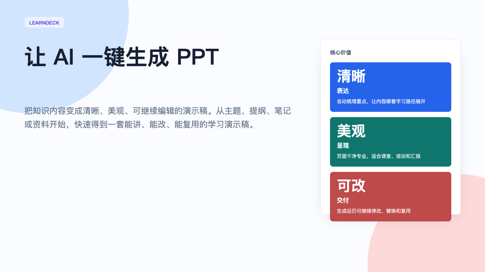
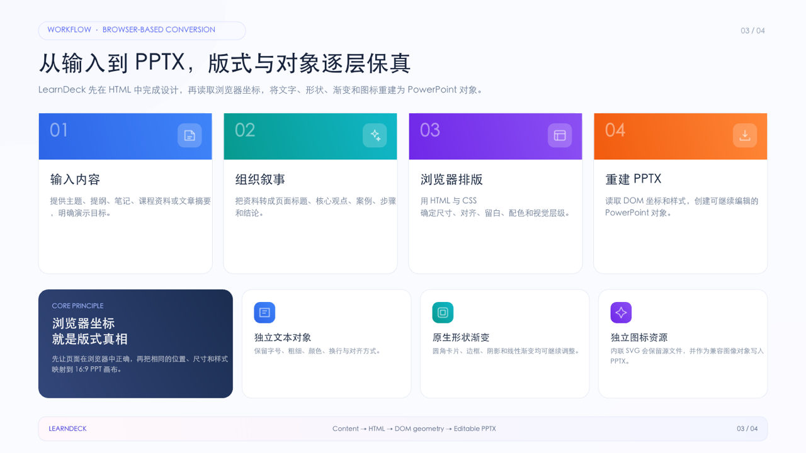

# LearnDeck 中文介绍

<p align="center">
  
</p>

## LearnDeck 是什么

LearnDeck 是一个让 AI 一键生成 PPT 的学习演示稿创作助手。

你可以从一个主题、一份提纲、一段课程资料、一篇文章摘要、一组学习笔记，甚至是一段还没有整理好的想法开始。LearnDeck 会帮助这些内容变成一套清晰、美观、可继续编辑的 PPT。

它的核心目标很简单：让 AI 先帮你生成一套高质量初稿，再保留后续修改、打磨和复用的空间。

## 它解决什么问题

很多学习型材料本身并不缺内容，真正困难的是包装和表达：

- 重点很多，但不知道该先讲什么、后讲什么
- 笔记很散，缺少适合展示的结构
- 页面里堆满文字，看起来不够清楚
- 课程或培训材料需要更正式、更有质感的呈现
- 生成出来的内容还需要能继续修改，而不是一次性定稿

LearnDeck 面向的正是这些场景。它像一个耐心的 AI 课件搭档，先帮你把内容讲顺，再把它包装成可以交付的页面。

## 适合哪些人

LearnDeck 适合所有需要把知识讲清楚的人：

- **老师与讲师**：把课程主题、章节内容、课堂提纲一键整理成正式课件
- **知识创作者**：把文章、笔记、教程、选题变成可分享的演示材料
- **培训负责人**：把内部资料、流程说明、方法论沉淀成培训演示稿
- **学习者与研究者**：把读书笔记、学习复盘、研究摘要整理成 PPT 汇报材料
- **团队协作者**：把零散共识包装成更适合开会讲解的知识页面

## 你会得到什么

LearnDeck 的交付结果更像是一套“学习型演示稿”，而不是普通页面拼接。

你可以期待：

- **一键生成 PPT**：从主题、提纲、笔记或学习资料快速得到演示稿初稿
- **更清楚的内容结构**：主题、章节、重点、案例和结论被整理得更有层次
- **更适合讲解的节奏**：页面顺序围绕学习者的理解路径展开
- **更有质感的视觉表达**：版式干净，重点突出，适合课堂、培训和汇报
- **按需求定制视觉**：根据受众、品牌、内容和参考图动态设计风格
- **更方便修改的结果**：后续可以继续调整文字、页面顺序和表达方式
- **更容易复用的材料**：同一套内容可以延展成课程、培训、分享或复盘

## 安装

运行：

```bash
npx --yes github:LearnAIHubC/LearnDeck
```

然后重启 Codex，使用 `$learn-deck`。

更新已有安装时运行：

```bash
npx --yes github:LearnAIHubC/LearnDeck --force
```

## HTML 直接生成 PPTX

LearnDeck 默认的创作链路不需要中间 JSON，也不限制在固定版式列表里：

`你的内容 + 视觉要求 → 模型逐页设计 HTML/CSS → 浏览器真实坐标 → 可编辑 PPTX`

模型会根据每页要表达的信息设计构图，再用共享的配色、字体、间距和视觉元素保持整套演示稿一致。现有 JSON 生成器仅作为需要确定性批量输出时的兼容选项保留。

模型生成 HTML 后，可直接转换：

```bash
node scripts/html_to_ppt.js \
  --input templates/learn-deck-polished-style.html \
  --out-dir output \
  --name learn-deck-polished-style
```

内置 HTML 是一套七页构图样本库，不是必须照搬的顺序、内容模板或固定版式。生成时保留视觉语言，只选择并重构适合用户内容的页面。

## 展示模板

- [查看七页精致浅色 HTML 构图样本库](templates/learn-deck-polished-style.html)
- [下载精致浅色可编辑 PPTX 风格模板](templates/learn-deck-polished-style.pptx)
- [下载中文可编辑 PPTX 模板](templates/learn-deck-showcase-zh.pptx)
- [下载英文可编辑 PPTX 模板](templates/learn-deck-showcase-en.pptx)

本 README 中的封面图和流程图均由这两套真实可编辑模板渲染生成。

## 适合制作什么

LearnDeck 特别适合这些类型的材料：

- 课程介绍与课程大纲
- 课堂讲义与知识卡片
- 企业内部培训课件
- 学习成果汇报
- 读书会分享材料
- 方法论介绍
- 产品或业务知识培训
- 主题研究与知识复盘

只要你的目标是“让别人更容易理解一件事”，LearnDeck 都可以成为一个很好的起点。

## 使用体验

使用 LearnDeck 的体验可以理解为四步：

1. **输入内容**：给出主题、笔记、提纲、文章摘要或课程资料
2. **AI 整理**：把内容拆成标题、重点、案例、步骤和结论
3. **生成 PPT**：形成一套视觉统一、节奏清楚的学习演示稿
4. **继续打磨**：根据你的语气、品牌、课堂风格或听众继续调整

<p align="center">
  
</p>

## 为什么叫 LearnDeck

“Learn” 代表学习内容、知识表达和教学场景。

“Deck” 代表一套可以被讲述、展示和复用的演示稿。

LearnDeck 这个名字想表达的是：它不是普通的页面生成工具，而是一个帮助知识形成完整 PPT 的 AI 创作伙伴。

## 项目愿景

LearnDeck 希望让更多人可以用 AI 轻松制作高质量学习材料。

它适合那些有内容、有经验、有想法，但不想把大量时间耗在排版、结构整理和页面包装上的人。好的课件应该帮助讲述者更顺畅地表达，也应该帮助学习者更轻松地理解。

LearnDeck 要做的，就是把这中间最费力的部分变得更轻、更快、更漂亮。
